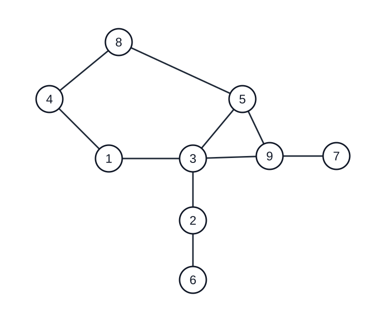

# 标准答案

所有小数均保留了足够的有效位。Q4 按日文原题所述的直径计算。

## Q1

下图给出一种无交叉画法；顶点的具体位置不唯一。



## Q2

### Q2-1

```text
25 25 25 25
```

### Q2-2

```text
0.5 0.5 0.5 0.5 0.5 0.5 0.5 0.5 0.5 0.5
```

### Q2-3

```text
0.415
```

### Q2-4

最小边数 $N$ 与 $G_3$ 的平均聚类系数：

```text
184
0.405333333
```

### Q2-5

```text
0.162428571
```

## Q3

依次为 $G_3$ 中 27 到 63 的距离、$G_4$ 中的距离、$G_3$ 的平均直径、$G_4$ 的平均直径：

```text
8
1
7.985656566
3.948888889
```

## Q4

```text
185 19
186 17
188 13
220 12
225 11
233 10
239 9
247 8
288 7
298 6
327 5
383 4
627 3
1332 2
4950 1
```
