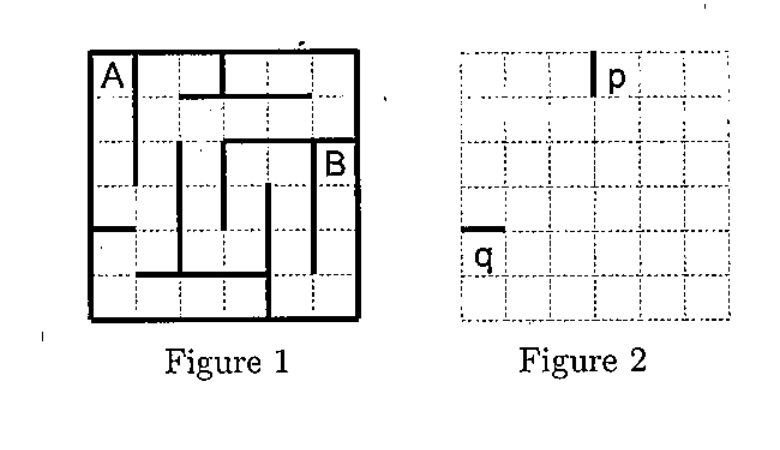
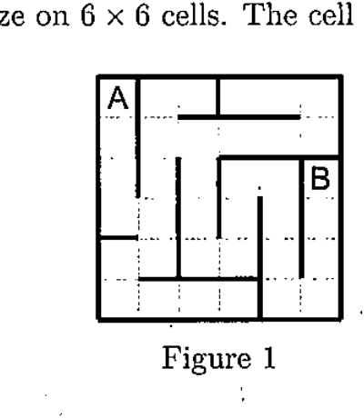

# Programming Problems

## Problem 1

Suppose that we have a maze on a square board with $m \times m$ cells. The cell in the $i$-th row and the $j$-th column is denoted by $(i,j)$, where $0 \le i \le m-1$ and $0 \le j \le m-1$. For example, Figure 1 shows a maze on $6 \times 6$ cells. The cell A is $(0,0)$ and the cell B is $(2,5)$.

The walls composing a maze are denoted as follows. The upper wall of the cell $(i,j)$ is denoted by $(2i, 2j+1)$, the lower wall is $(2i+2, 2j+1)$, the left wall is $(2i+1, 2j)$, and the right wall is $(2i+1, 2j+2)$. For example, the wall p in Figure 2 is $(1,6)$ and the wall q is $(8,1)$.



The layout of walls composing a maze is stored as a character string such as:

```text
0,1,1,0,13,6,8,1
```

This represents that there are four walls $(0,1)$, $(1,0)$, $(13,6)$, and $(8,1)$.

### (1)

We have a maze on $3 \times 3$ cells. The layout of the walls is stored in file `maze1.txt`. Draw this maze so that the layout of the walls will be clearly depicted.

### (2)

We have a maze on $40 \times 40$ cells. The layout of the walls is stored in file `maze2.txt`. Count the number of the dead-end cells, which are surrounded with three walls. Write down that number.

### (3)

We have a maze on $40 \times 40$ cells. The layout of the walls is stored in file `maze3.txt`. The start is the cell $(0,0)$ and the goal is the cell $(39,29)$.

Count the number of the cells that will be visited when we move from the start to the goal along the shortest path. Write down that number. Count the start and the goal for one, respectively. Assume that there exists exactly one path between any pair of two cells in the maze.

### (4)

We have ten mazes on $40 \times 40$ cells. The layout of the walls for each maze is stored in a file from `maze10.txt` to `maze19.txt`. Which maze satisfies that there exists exactly one path between any pair of two cells in the maze? Write down the names of all the files in which the layouts of the walls are stored for such a maze.

---

## Problem 2

Suppose that we have a maze on a square board with $m \times m$ cells. The cell in the $i$-th row and the $j$-th column is denoted by $(i,j)$, where $0 \le i \le m-1$ and $0 \le j \le m-1$. For example, Figure 1 shows a maze on $6 \times 6$ cells. The cell A is $(0,0)$ and the cell B is $(2,5)$.



When a sequence of numbers is stored, we store a character string in a file as follows:

```text
2,0,13,0,1,6,8,1
```

This denotes the sequence of numbers where the 0th number is 2, the 1st number is 0, the 2nd number is 13, ... All the elements in a sequence are integers more than or equal to zero.

### (1)

A sequence of numbers $\{s_k\}$ is stored in file `sequence.txt`. Write down the 216-th element $s_{216}$ in that sequence. Furthermore, write down the maximum number among the elements in that sequence.

### (2)

Make a maze on $40 \times 40$ cells in accordance with the following instructions. A sequence of numbers $\{p_k\}$ is stored in file `p.txt`. Its elements are either 0, 1, 2, or 3.

1. Put walls along the outer limits of the maze.
2. For every pair of $i$ and $j$, where $1 \le i \le 39$ and $1 \le j \le 39$:
   - put the upper wall for cell $(i,j)$ when $p_s$ is 0,
   - put the left wall for cell $(i,j)$ when $p_s$ is 1,
   - put the lower wall for cell $(i-1,j-1)$ when $p_s$ is 2,
   - put the right wall for cell $(i-1,j-1)$ when $p_s$ is 3.

Here, $s=i\times40+j$ and $p_s$ is the $s$-th element of the sequence of numbers $\{p_k\}$. Note that, for different pairs of $i$ and $j$, the same wall may be put.

#### (2-a)

Write down the existence of the upper, lower, left, and right walls for cells $(5,25)$, $(20,20)$, and $(30,33)$ in this maze.

#### (2-b)

Write down the number of the L-shaped corner cells in this maze. A cell is a L-shaped corner cell when it is surrounded with exactly two walls directly jointed to form L-shape.

### (3)

Make a maze on $40 \times 40$ cells in accordance with the following instructions. The start is cell $(0,0)$ and the goal is cell $(39,27)$. A cell surrounded with four walls is called a *closed cell*.

1. Put the upper, lower, left, and right walls for all the cells so that all the cells are closed cells.
2. Set the current position to the start cell.
3. Select a closed cell N in the maze among the upper, lower, left, and right cells adjacent to the current position. Then remove the wall separating the selected cell N and the current position. Move the current position to that cell N. Repeat this again.

   When selecting the cell N, refer to the sequence of numbers $\{n_k\}$ stored in file `neighbor.txt`. The elements of this sequence are either 0, 1, 2, or 3.

   Suppose that the current position is $(i,j)$. Let $n_s$ be the $s$-th element of the sequence $\{n_k\}$. For given $s$, when $n_s$ is 0, select the upper cell of the cell $(i,j)$. When it is 1, select the left cell. When it is 2, select the lower cell. When it is 3, select the right cell for N, respectively. Here, $s=i+j+h$. Choose $h$ for selecting N. $h$ is an integer more than or equal to zero and also $h$ is the minimum integer such that a closed cell is selected for N.

   When no cell is selectable for N, select a cell C. The cell C must not be a closed cell. Furthermore, at least one adjacent cell to C must be a closed cell. Move the current position to that cell C. When a necessary element of the sequence $\{n_k\}$ does not exist, select a cell C and move the current position to that cell C.

   When selecting the cell C, refer to the sequence of numbers $\{c_k\}$ stored in file `cell.txt`. Its elements are integers less than 40 and more than or equal to zero.

   Suppose that the current position is $(i,j)$. Select a cell $(c_t,c_{t+1})$ such that $t$ is minimum among the cells satisfying the requirements for C. Here, $t=2(i+j+h)$ and $h$ is an integer more than or equal to zero.

   When no cell is selectable for C, the maze is completed. When a necessary element of the sequence $\{c_k\}$ does not exist, the maze is also completed.

#### (3-a)

Write down the existence of the upper, lower, left, and right walls for cells $(5,25)$, $(20,20)$, and $(30,33)$ in this maze.

#### (3-b)

Write down the number of the L-shaped corner cells in this maze. A cell is a L-shaped corner cell when it is surrounded with exactly two walls directly jointed to form L-shape.

#### (3-c)

Find the longest straight passages in this maze and write their length down. Furthermore, write down the number of such longest passages. For example, the path between cells $(0,1)$ and $(4,1)$ in Figure 1 is a straight passage and its length is 5, which is the number of its cells. For the maze in Figure 1, a passage with length 5 is the longest and there are two such passages.

#### (3-d)

We can reach the goal of this maze when proceeding through the maze by always keeping one wall on the left-hand side in the direction of the move. Write down the number of the cells visited on the way to the goal. When the same cell is visited twice, that cell is counted only once. Include the start and the goal cells in the cells visited on the way. At first, the upper wall of the start cell is on the left-hand side in the direction of the move.
